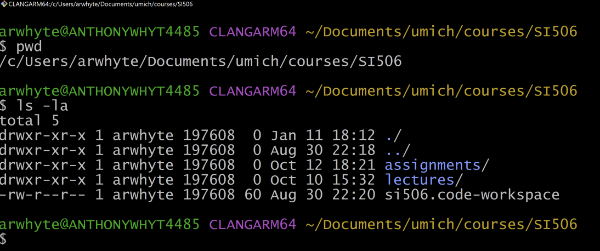

# Bonus challenge: SI 506 "workspace" directory structure (max = 10 pts)

## Goals

1. Create a common directory structure for SI 506 content using the command line (i.e., the
   terminal).
2. Practice navigating your file system using the command line.
3. Practice creating and removing directories using the command line.
4. Designate a VS Code workspace for SI 506 content.
5. Take a screenshot of your "workspace" directory structure and upload it to Gradescope.

### Directory structure

From your home directory `/Users/< your account name >` (macOS) or `c/Users/< your account name >`
(Windows) you will create the following directory structure to hold SI 506 content.

```commandline
Documents/
    umich/
        courses/
            SI504/
            SI506/
                assignments/
                    ps_01/
                    ...
                lectures/
                    lec_01/
                        ...
                     ...
                si506.code-workspace
```

## 1.0 Terminal: create the directory structure

Open `Terminal.app` (macOS) or `Git Bash` (Windows). The terminal session should start in your
home directory (confirm with `pwd`).

:bulb: `Terminal.app` (macOS) can be found in `Applications/Utilities`. Windows users can employ the
search feature to locate and open `Git Bash` (assuming, of course, that you have installed
Git for Windows. If not consult the relevant install guide at
[https://si506.org/guides/](https://si506.org/guides/)).

### 1.1 Create path to `SI506` directory

1. Print the working (i.e., current) directory path.

2. List the directory contents (long format) including all hidden files.

3. Clear the screen.

4. Navigate (i.e., change) to the `~/Documents` directory.

5. List the directory contents (long format) including all hidden files.

6. Create a directory named `umich`.

7. Navigate to the `umich` directory.

8. Create a subdirectory named `courses`.

9. Create a subdirectory named `courses/SI506`.

10. Create a sibling subdirectory named `courses/SI504`.

### 1.2 Add `SI506` subdirectories

1. Navigate to the `courses/SI504` directory.

2. Oops. Navigate to the "adjacent" `SI506` directory.

3. Create a subdirectory named `lectures`.

4. Create a sibling subdirectory named `assignments`.

5. Create a sibling subdirectory named `notes`.

6. Oops. Remove directory named `notes` (don't need it).

7. Create a subdirectory in `lectures` named `week_01` (do not change directories to perform this
   task).

8. Create a subdirectory in `lectures` named `week_02` (do not change directories to perform this
   task).

9. Navigate to the `assignments` directory.

10. Create a subdirectory named `ps_01`.

11. Create a subdirectory named `ps_02`.

12. Change directories up two levels to the `SI506/` directory. __Do not__ close the terminal.

### 2.0 VS Code: create an SI 506 workspace

A VS Code workspace is a collection of one or more directories and their file contents
that can be opened at the same time in a VS Code window. Various configuration settings can be
assigned to a workspace. Think of a workspace as akin to a project; consider the SI 506 files
that you will accrue across the semester as members of a single project. For more information on
VS Code workspaces see
[https://code.visualstudio.com/docs/editor/workspaces](https://code.visualstudio.com/docs/editor/workspaces).

1. Open VS Code and navigate to the `SI506` folder (_File -> Open..._).

2. Create a VS Code workspace (_File -> Save Workspace As..._). Save the `SI506.code-workspace` file in the
   `SI506` directory. Save the changes (_File -> Save_ or use your keyboard: macOS: `Command + S`;
   Windows: `Ctrl + S`).

   :exclamation: Make sure that you save the file in the "root" `SI506` directory.

## 3.0 Terminal: upload screenshot

1. Return to your terminal and navigate to your SI 506 "workspace" directory (if not already there).

2. Once you have reached the `si506` directory, issue the following commands:

   1. `pwd` (print working directory)
   2. `ls -la` (list all files and directories, including hidden files and directories)

3. Take a screenshot of your SI 506 "workspace" directory.

   :exclamation: the screenshot is expected to include the subdirectories `assignments` and
   `lectures` as well as the VS Code file `si506.code-workspace`.

4. Upload the screenshot to Gradescope.

5. The teaching team will review your screenshot and award points.

## 4.0 Terminal: example screenshots

### 4.1 macOS

   

   

### 4.2 Windows

   
